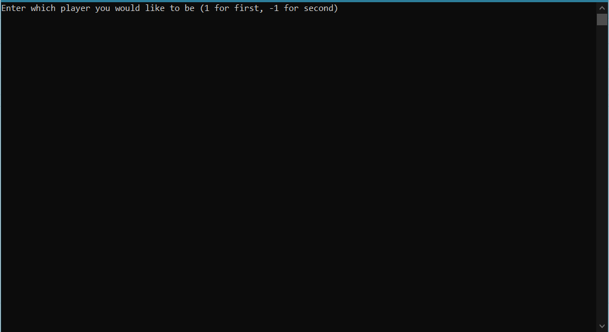
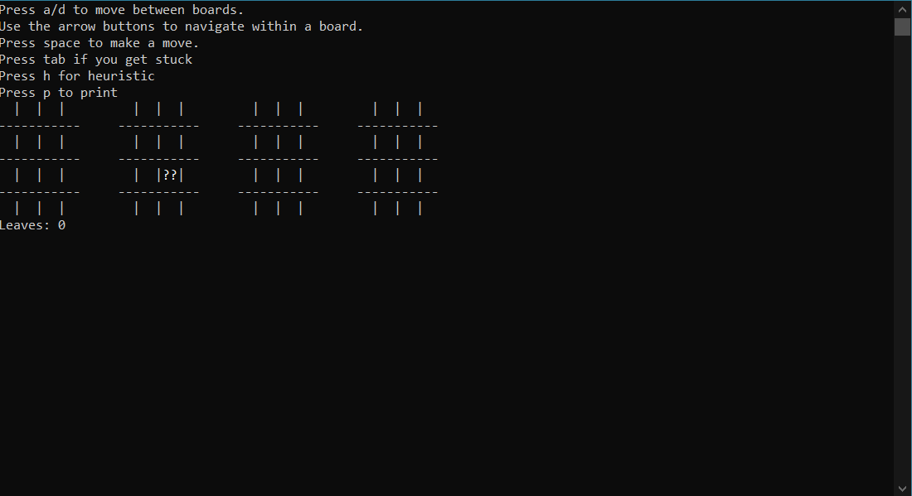
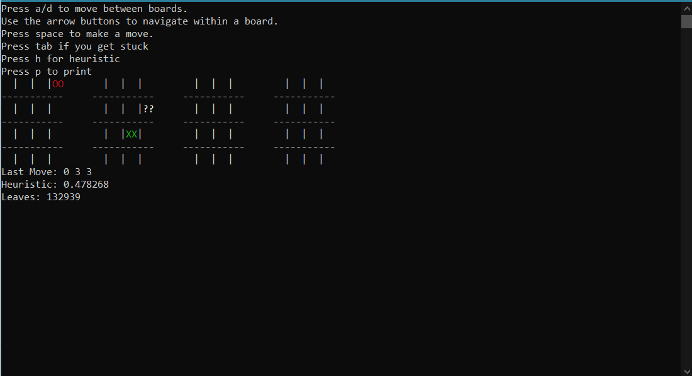
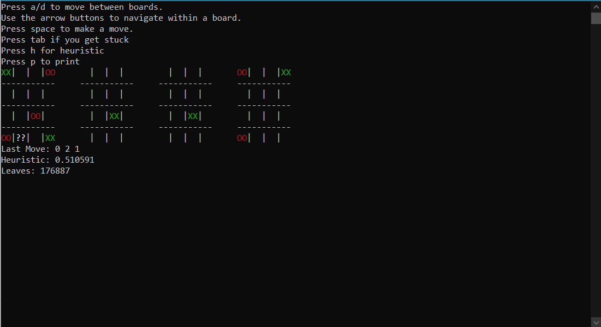
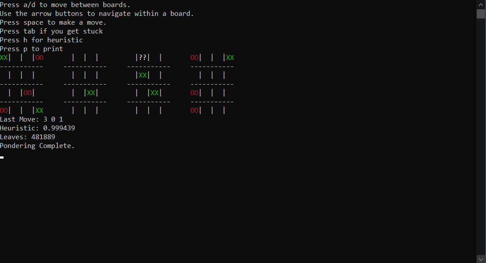
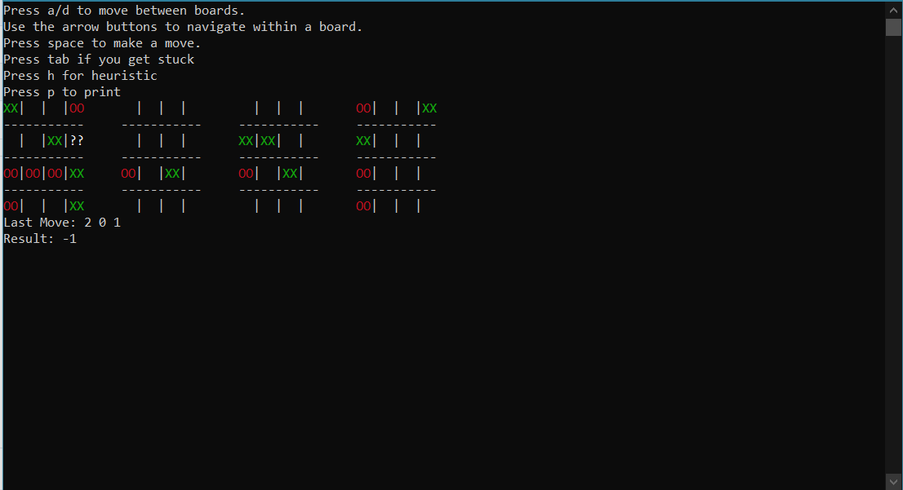

Play 3D Tic Tac Toe with a pretty good bot.

Download/Run the executable.

The source code is main.cpp.

Here is the game on Wikipedia, if you don't know how to play: https://en.wikipedia.org/wiki/3D_tic-tac-toe

If you manage to beat the bot, send me the GameRecord.txt that it generates!

Screenshots of a game I lost below:

